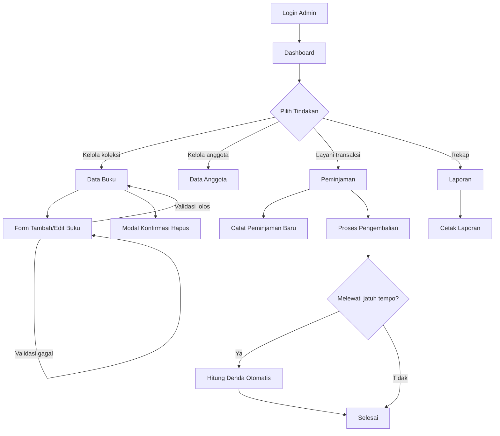

# Perancangan Admin Panel Sistem Informasi Perpustakaan Digital

- **Institusi:** Universitas Pamulang
- **Mata kuliah:** Pemrograman Web 2
- **Penugasan:** Tugas Ke-1 — Project-Based Learning
- **Keluaran:** Dokumentasi Milestone 1

## 1. Deskripsi sistem

Admin Panel Sistem Informasi Perpustakaan Digital mengelola koleksi buku dan kategorinya, keanggotaan, sirkulasi peminjaman dan pengembalian, serta denda keterlambatan. Petugas dapat melihat statistik dashboard, mencari dan memperbarui data, mencatat transaksi, serta mencetak laporan periode melalui antarmuka glassmorphism dengan mode gelap dan terang.

Aplikasi berjalan sepenuhnya di sisi klien menggunakan HTML, CSS, dan JavaScript vanilla tanpa proses build atau backend. Data awal berupa mock data JavaScript yang dipersistensi ke localStorage; autentikasi juga berupa simulasi akun demo. Server statis hanya menyajikan berkas aplikasi, sehingga data dan sesi tidak dibagikan melalui basis data server.

## 2. Hirarki menu

Blok berikut disalin utuh dari spec Bagian 5.1.

```
Dashboard

Master Data
  ├── Data Buku
  └── Data Anggota

Transaksi
  ├── Peminjaman
  └── Pengembalian

Laporan
  └── Laporan Sirkulasi

────────────────
Pengaturan
Keluar
```

| Menu | Berkas | Fungsi singkat |
|---|---|---|
| Login | `index.html` | Masuk admin dengan validasi surel dan kata sandi |
| Dashboard | `pages/dashboard.html` | Empat kartu statistik, dua grafik, tiga panel ringkasan |
| Data Buku | `pages/data-buku.html` | Tabel koleksi dengan cari, saring, urut, dan hapus |
| Data Anggota | `pages/data-anggota.html` | Tabel keanggotaan dengan modal tambah dan ubah |
| Peminjaman | `pages/peminjaman.html` | Sirkulasi pinjam dan kembali, denda dihitung otomatis |
| Form Buku | `pages/form-buku.html` | Tambah dan ubah buku dengan validasi serta pratinjau sampul |
| Laporan | `pages/laporan.html` | Rekap periode, grafik, dan keluaran siap cetak |

Tabel tersebut berisi tujuh halaman pengguna. `pages/layout.html` merupakan template master Milestone 2, di luar tujuh halaman itu. Peminjaman dan Pengembalian menggunakan `pages/peminjaman.html` dengan tab Peminjaman Aktif dan Riwayat. Pengaturan adalah modal profil petugas, pilihan tema, dan reset data demo, dipicu event `bukapengaturan` serta ditangani `assets/js/page-pengaturan.js`. Keluar mengakhiri sesi dan mengarah ke login.

## 3. Entity Relationship Diagram

Blok Mermaid berikut disalin utuh dari spec Bagian 5.2. Ini model konseptual: kode menggunakan properti camelCase dan `id` sebagai identitas tiap entitas; buku juga memiliki `sinopsis`.

```mermaid
erDiagram
    PETUGAS ||--o{ PEMINJAMAN : "melayani"
    ANGGOTA ||--o{ PEMINJAMAN : "mengajukan"
    KATEGORI ||--o{ BUKU : "mengelompokkan"
    PEMINJAMAN ||--|{ DETAIL_PEMINJAMAN : "memiliki"
    BUKU ||--o{ DETAIL_PEMINJAMAN : "dipinjam pada"
    PEMINJAMAN ||--o| DENDA : "menghasilkan"

    PETUGAS {
        string id_petugas PK
        string nama
        string username
        string email
        string role
    }
    ANGGOTA {
        string id_anggota PK
        string nim
        string nama
        string email
        string telepon
        string jurusan
        int    angkatan
        date   tgl_daftar
        string status
    }
    KATEGORI {
        string id_kategori PK
        string nama_kategori
        string kode_ddc
    }
    BUKU {
        string id_buku PK
        string isbn
        string judul
        string pengarang
        string penerbit
        int    tahun_terbit
        string id_kategori FK
        int    jumlah_total
        int    jumlah_tersedia
        string lokasi_rak
        string cover
    }
    PEMINJAMAN {
        string id_pinjam PK
        string id_anggota FK
        string id_petugas FK
        date   tgl_pinjam
        date   tgl_jatuh_tempo
        date   tgl_kembali
        string status
    }
    DETAIL_PEMINJAMAN {
        string id_detail PK
        string id_pinjam FK
        string id_buku FK
        string kondisi_kembali
    }
    DENDA {
        string id_denda PK
        string id_pinjam FK
        int    hari_terlambat
        int    nominal
        string status_bayar
    }
```



## 4. Alur pengguna

Blok berikut disalin utuh dari spec Bagian 5.3.



## 5. Aturan bisnis

| Aturan implementasi | Alasan pemilihan untuk simulasi |
|---|---|
| Masa pinjam 7 hari | Siklus mingguan memudahkan penentuan tanggal jatuh tempo dan demo pengembalian. |
| Denda Rp1.000 per hari terlambat | Nominal tetap memudahkan penjelasan dan pemeriksaan perhitungan keterlambatan. |
| Maksimal 3 buku per anggota yang masih dipinjam | Membatasi penguasaan koleksi agar stok dapat dipakai anggota lain. |

Aturan tersebut diimplementasikan di `assets/js/store.js`; alasan di atas adalah pertimbangan desain simulasi, bukan kebijakan resmi institusi.
Denda dihitung dari jumlah hari keterlambatan dikali Rp1.000, dan pengembalian memperbarui stok.

Data memakai kunci localStorage `elibrary.db.v1`, sesi `elibrary.session`, serta preferensi tema `elibrary.theme`.
Prefiks ID adalah buku `BK`, anggota `AG`, kategori `KT`, peminjaman `PJ`, detail `DT`, denda `DN`, dan petugas `PT`, dengan nomor urut tiga digit seperti `BK001`.

## 6. Design System

### Warna

Tabel berikut disalin dari spec Bagian 4.1; nilai HEX warna dan RGBA transparansi dipertahankan.

**Latar dan permukaan**

| Token | Mode Gelap (default) | Mode Terang |
|---|---|---|
| `bg-base` | gradien mesh `#0B1020` → `#131A33` | gradien mesh `#EEF2FF` → `#E0E7FF` |
| `glass` | `rgba(255,255,255,0.08)` | `rgba(255,255,255,0.65)` |
| `glass-strong` (tabel) | `rgba(255,255,255,0.14)` | `rgba(255,255,255,0.86)` |
| `glass-border` | `rgba(255,255,255,0.18)` | `rgba(255,255,255,0.90)` |
| `text` | `#F8FAFC` | `#0F172A` |
| `text-muted` | `#94A3B8` | `#475569` |

**Warna aksen dan maknanya**

| Token | Nilai | Dipakai untuk |
|---|---|---|
| `primary` | `#6366F1` (indigo) | Aksi utama, menu aktif, garis grafik utama |
| `success` | `#14B8A6` (teal) | Buku tersedia, anggota aktif, pengembalian tepat waktu |
| `warning` | `#F59E0B` (amber) | Mendekati jatuh tempo (sisa ≤ 2 hari) |
| `danger` | `#F43F5E` (rose) | Terlambat, tombol hapus, galat validasi |

Warna tidak pernah menjadi satu-satunya penanda status. Setiap lencana status selalu
menyertakan teks, sehingga tetap terbaca oleh pengguna dengan buta warna.

### Tipografi, bentuk, dan kedalaman

- Heading: Plus Jakarta Sans, bobot 600/700; teks isi dan data: Inter, bobot 400/500/600.
- Skala tipografi utama: 12 / 14 / 16 / 20 / 24 / 32 / 40 px; komponen CSS juga memakai ukuran khusus seperti label 13 px.
- Angka tabular memakai `font-variant-numeric: tabular-nums`.
- Radius utama: 12 px untuk kontrol, 16 px untuk kartu, 24 px untuk panel, 999 px untuk lencana; tombol ikon memakai 10 px.
- Blur: 12 / 20 / 32 px; kartu memakai 20 px, panel, sidebar, dan modal memakai 32 px.
- Spasi mengikuti kelipatan 4 px dengan jarak baku antarkartu 24 px.

| Bayangan | Mode gelap | Mode terang |
|---|---|---|
| Kartu | `0 8px 32px rgba(0,0,0,0.24)` | `0 8px 32px rgba(15,23,42,0.10)` |
| Modal | `0 24px 64px rgba(0,0,0,0.4)` | `0 24px 64px rgba(15,23,42,0.22)` |

Token Tailwind hidup di `assets/js/config.js`: aksen `brand`, `ok`, `warn`, `bad` memetakan primary, success, warning, danger, disertai keluarga font, radius, dan blur. Implementasi variabel dua tema, bayangan, serta ukuran komponen berada di `assets/css/style.css`. Dokumentasi dan Figma harus mengikuti kedua sumber kode ini ketika nilainya berubah; sinkronisasi dokumen dilakukan secara manual.

## 7. Komponen reusable

- `.glass-card`: kartu radius 16 px dengan permukaan transparan dan blur 20 px.
- `.glass-panel`: panel radius 24 px dengan blur 32 px untuk area besar.
- `.glass-strong`: permukaan lebih opak untuk keterbacaan tabel, dengan radius 24 px.
- `.btn`: dasar tombol dengan varian `.btn-primary` untuk aksi utama, `.btn-ghost` untuk aksi sekunder, `.btn-danger` untuk tindakan hapus, serta `.btn-icon` untuk tombol ikon.
- `.badge`: lencana bertitik dan berteks dengan varian `.badge-ok`, `.badge-warn`, `.badge-bad`, serta `.badge-muted`.
- `.chip`: penanda kategori ringkas berbentuk pil.
- `.glass-input`: input konsisten dengan indikator fokus dan keadaan validasi tidak valid.
- `DataTable`: komponen di `assets/js/table.js` untuk pencarian, penyaringan, pengurutan, paginasi, dan keadaan kosong.

## 8. Wireframe

Ketiga wireframe berikut disalin utuh dari brief; angka dan singkatan di dalamnya merupakan ilustrasi rancangan, sedangkan data aktual mengikuti store saat aplikasi berjalan. Pada lebar di bawah 768 px, tabel disajikan sebagai kartu berlabel.

### Wireframe 1 — Dashboard (desktop, 1440px)

```
┌──────────────┬──────────────────────────────────────────────────────────┐
│ [P] Perpus   │ ☰  Dashboard                          [☀] [AR]           │
│     Digital  ├──────────────────────────────────────────────────────────┤
│     UNPAM    │ ┌────────┐ ┌────────┐ ┌────────┐ ┌────────┐              │
│              │ │ Total  │ │Anggota │ │Sedang  │ │Terlam- │              │
│ ▸ Dashboard  │ │Koleksi │ │ Aktif  │ │Dipinjam│ │  bat   │              │
│              │ │   24   │ │   15   │ │   11   │ │    4   │              │
│ MASTER DATA  │ └────────┘ └────────┘ └────────┘ └────────┘              │
│   Data Buku  │ ┌──────────────────────────────┐ ┌─────────────────────┐ │
│   Data Anggt │ │ Tren Sirkulasi (area chart)  │ │ Komposisi Koleksi   │ │
│              │ │                              │ │    (doughnut)       │ │
│ TRANSAKSI    │ │        ╱╲    ╱╲╱             │ │       ◜◝            │ │
│   Peminjaman │ │   ╱╲ ╱   ╲╱                  │ │      ◟  ◞           │ │
│   Pengembln  │ └──────────────────────────────┘ └─────────────────────┘ │
│              │ ┌────────────┐ ┌────────────┐ ┌────────────────────────┐ │
│ LAPORAN      │ │ Aktivitas  │ │ Buku       │ │ Jatuh Tempo            │ │
│   Lap. Sirkl │ │ Terbaru    │ │ Terpopuler │ │ ● Terlambat 5 hari     │ │
│ ───────────  │ │ ● ...      │ │ 1. ▇▇▇▇    │ │ ● Jatuh tempo hari ini │ │
│ Pengaturan   │ │ ● ...      │ │ 2. ▇▇▇     │ │                        │ │
│ Keluar       │ └────────────┘ └────────────┘ └────────────────────────┘ │
└──────────────┴──────────────────────────────────────────────────────────┘
```

### Wireframe 2 — Halaman Data Master (Data Buku)

```
┌──────────────┬──────────────────────────────────────────────────────────┐
│  SIDEBAR     │ ☰  Data Buku                          [☀] [AR]           │
│              ├──────────────────────────────────────────────────────────┤
│              │ ┌──────────────────────────────────────────────────────┐ │
│              │ │ 🔍 Cari judul…  │Kategori▾│ │Status▾│   [+ Tambah]   │ │
│              │ ├──────────────────────────────────────────────────────┤ │
│              │ │ JUDUL ↕    │ISBN ↕ │KATEGORI│RAK │STOK ↕│STATUS│AKSI │ │
│              │ ├────────────┼───────┼────────┼────┼──────┼──────┼─────┤ │
│              │ │ ▤ Algoritma│978602…│〈Tekno〉│R-07│ 6/6  │●Ada  │ ✎ 🗑│ │
│              │ │   Rinaldi  │       │        │    │      │      │     │ │
│              │ ├────────────┼───────┼────────┼────┼──────┼──────┼─────┤ │
│              │ │ ▤ Bumi Man.│978602…│〈Sastra〉│R-08│ 8/9 │●Ada  │ ✎ 🗑│ │
│              │ ├──────────────────────────────────────────────────────┤ │
│              │ │ Menampilkan 1–8 dari 24 data      [←][1][2][3][→]    │ │
│              │ └──────────────────────────────────────────────────────┘ │
└──────────────┴──────────────────────────────────────────────────────────┘
```

### Wireframe 3 — Halaman Form (Form Buku) & Mode Mobile

```
FORM (desktop)                          TABEL → KARTU (mobile, <768px)
┌────────────────────────────────┐      ┌──────────────────────┐
│ Informasi Bibliografi          │      │ ☰  Data Buku    [☀]  │
│ Identitas utama buku…          │      ├──────────────────────┤
│ ┌────────────────────────────┐ │      │ 🔍 Cari…             │
│ │ Judul Buku                 │ │      │ [Kategori▾][Status▾] │
│ └────────────────────────────┘ │      │ [   + Tambah Buku  ] │
│ ┌───────────┐ ┌──────────────┐ │      ├──────────────────────┤
│ │ Pengarang │ │ Penerbit     │ │      │ ╭──────────────────╮ │
│ └───────────┘ └──────────────┘ │      │ │ JUDUL  ▤ Algorit.│ │
│ ┌───────────┐ ┌──────────────┐ │      │ │ ISBN   978602331 │ │
│ │ ISBN      │ │ Tahun Terbit │ │      │ │ KATEG. 〈Teknologi〉│ │
│ └───────────┘ └──────────────┘ │      │ │ RAK    R-07-A    │ │
│ ⚠ ISBN harus 10 atau 13 digit  │      │ │ STOK   6 / 6     │ │
├────────────────────────────────┤      │ │ STATUS ● Tersedia│ │
│ Klasifikasi dan Lokasi         │      │ │ AKSI      ✎  🗑  │ │
│ ┌───────────┐ ┌──────────────┐ │      │ ╰──────────────────╯ │
│ │ Kategori ▾│ │ Lokasi Rak   │ │      │ ╭──────────────────╮ │
│ └───────────┘ └──────────────┘ │      │ │ JUDUL  ▤ Bumi Ma.│ │
├────────────────────────────────┤      │ │ …                │ │
│ Ketersediaan Stok              │      │ ╰──────────────────╯ │
│ ┌───────────┐ ┌──────────────┐ │      └──────────────────────┘
│ │ Total     │ │ Tersedia     │ │
│ └───────────┘ └──────────────┘ │      Tabel BERUBAH BENTUK jadi
├────────────────────────────────┤      kartu berlabel — bukan
│ Sampul Buku                    │      digulir ke samping.
│ ┌────┐  [Pilih berkas]         │
│ │ ▤  │  [Hapus Sampul]         │
│ └────┘                         │
├────────────────────────────────┤
│              [Batal] [Simpan]  │
└────────────────────────────────┘
```

## 9. Tautan rancangan

- **Figma (Design System & High-Fidelity UI):** [LINK FIGMA ANDA]
- **Stitch by Google (Wireframe & User Flow):** [SCREENSHOT STITCH]

Ganti penanda Figma dengan tautan rancangan pada akun Anda, dan penanda Stitch dengan tangkapan layar wireframe serta user flow dari akun Anda sebelum pengumpulan.

## 10. Catatan design system hidup

Buka [design system hidup](design-system.html) melalui server statis di peramban untuk melihat token dan komponen dalam keadaan jadi pada kedua mode. Gunakan nilai yang ditampilkan beserta `assets/js/config.js` dan `assets/css/style.css` sebagai sumber saat menyusun Figma. Cara menjalankan aplikasi serta cakupan pengujian tersedia di [README](../README.md).

Dokumen ini merupakan keluaran Milestone 1 untuk LMS Mentari. Slot rancangan pribadi masih harus dilengkapi pengguna; rendering Mermaid pada GitHub perlu diperiksa controller.
