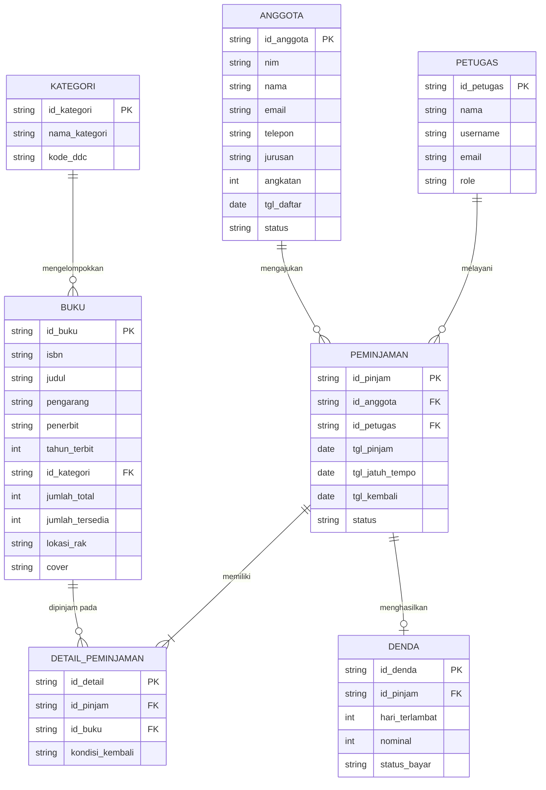
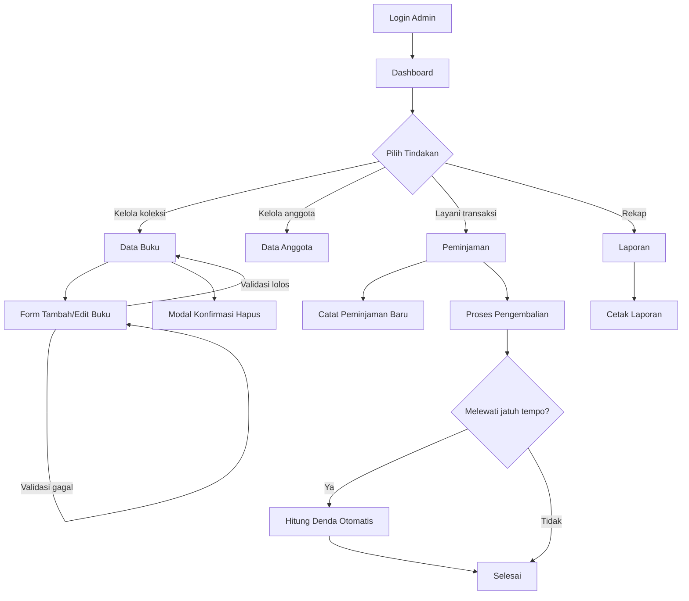

# Desain: Admin Panel Sistem Informasi Perpustakaan Digital (E-Library)

| | |
|---|---|
| **Tanggal** | 14 September 2026 |
| **Mata Kuliah** | Pemrograman Web 2 (Client-Side Programming) |
| **Institusi** | Universitas Pamulang |
| **Topik (Presensi 1)** | Sistem Informasi Perpustakaan Digital (E-Library) |
| **Bobot** | Tugas Ke-1, Project-Based Learning |
| **Status** | Disetujui — siap masuk tahap rencana implementasi |

---

## 1. Ringkasan

Membangun **Admin Panel (back-office)** untuk sistem perpustakaan digital Universitas
Pamulang. Seluruh aplikasi berjalan di sisi klien: tidak ada server, tidak ada database,
tidak ada proses build. Data disimulasikan dengan mock data JavaScript yang dipersistensi
ke `localStorage`, sehingga operasi tambah/ubah/hapus tetap bertahan setelah halaman
dimuat ulang.

Fokus penilaian ada pada arsitektur informasi, kejelasan navigasi, estetika antarmuka,
dan pengalaman pengguna — bukan pada kelengkapan logika bisnis. Keputusan desain di
dokumen ini konsisten mengutamakan hal tersebut.

**Tujuan yang ingin dicapai:**

1. Antarmuka bergaya **Glassmorphism** yang konsisten dan terlihat modern, tanpa
   mengorbankan keterbacaan data tabular.
2. Navigasi yang bisa dipahami tanpa penjelasan — seorang pustakawan bisa menebak isi
   tiap menu dari namanya.
3. Interaktivitas nyata dengan JavaScript murni: modal, validasi, grafik, pencarian,
   penyaringan, dan persistensi data.
4. Responsif penuh dari layar 375 px sampai 1440 px.

---

## 2. Keputusan Teknis

| Keputusan | Pilihan | Alasan |
|---|---|---|
| Tema visual | **Glassmorphism** | Salah satu dari empat tema wajib. Paling menonjol saat demo dan cocok dengan nuansa tenang perpustakaan digital. |
| Framework CSS | **Tailwind CSS via CDN** (`cdn.tailwindcss.com`) | Disebut eksplisit sebagai opsi di panduan. Tanpa build step sehingga deploy ke Vercel/GitHub Pages cukup dengan unggah berkas statis. |
| Design token | Blok `tailwind.config` inline di `assets/js/config.js` | Satu sumber kebenaran untuk warna, tipografi, radius, dan blur. Nilai yang sama dipetakan ke Figma. |
| Efek khas glass | `@layer components` di `assets/css/style.css` | `backdrop-filter` berlapis dan border gradien tidak tersedia sebagai utility Tailwind. Menulisnya sebagai komponen menjaga HTML tetap bersih. |
| Penyimpanan data | **Mock JS + `localStorage`** | CRUD terasa nyata saat demo tanpa backend apa pun. Tetap 100% client-side sesuai syarat tugas. |
| Grafik | **Chart.js** via CDN | Disebut eksplisit di panduan sebagai contoh library client-side. |
| Mode tampilan | **Gelap sebagai default + tombol ke mode terang** | Efek frosted glass paling hidup di atas latar gelap. Tombol tema menambah satu komponen interaktif yang mudah didemonstrasikan. |
| JavaScript | Vanilla ES6+, tanpa framework | Sesuai konteks mata kuliah Client-Side Programming. |

**Catatan jujur soal CDN Tailwind:** `cdn.tailwindcss.com` menampilkan peringatan
"not for production" di console browser. Untuk tugas ini hal tersebut dapat diterima dan
justru menghilangkan kebutuhan Node.js/npm saat pengumpulan. Peringatan ini akan
disebutkan di `README.md` agar tidak dikira sebagai galat.

---

## 3. Struktur Proyek

Mengikuti struktur folder yang dicontohkan panduan.

```
Project/
├── index.html                     Halaman Login Admin
├── README.md                      Ringkasan proyek, cara menjalankan, link demo
├── docs/
│   ├── perancangan.md             Keluaran Milestone 1
│   └── design-system.html         Style guide hidup (untuk di-screenshot & disalin ke Figma)
├── assets/
│   ├── css/
│   │   └── style.css              @layer components: glass, tabel, form, sidebar, cetak
│   ├── js/
│   │   ├── config.js              tailwind.config — seluruh design token
│   │   ├── data.js                Seed mock data
│   │   ├── store.js               Lapisan CRUD di atas localStorage
│   │   ├── ui.js                  Modal, toast, validator, formatter
│   │   ├── layout.js              Sidebar, tema, navigasi aktif, penjaga sesi
│   │   ├── page-dashboard.js
│   │   ├── page-buku.js
│   │   ├── page-anggota.js
│   │   ├── page-peminjaman.js
│   │   ├── page-form-buku.js
│   │   ├── page-laporan.js
│   │   └── page-login.js
│   └── img/                       logo.svg, favicon, placeholder sampul
└── pages/
    ├── dashboard.html
    ├── data-buku.html
    ├── data-anggota.html
    ├── peminjaman.html
    ├── form-buku.html
    └── laporan.html
```

### Pembagian tanggung jawab

Batas antar modul dijaga tegas agar tiap berkas dapat dijelaskan sendiri saat presentasi:

- **`store.js`** — hanya urusan data. Tidak menyentuh DOM sama sekali. Mengekspos
  `Store.buku.all()`, `.find(id)`, `.create(obj)`, `.update(id, obj)`, `.remove(id)`,
  dan seterusnya untuk tiap entitas. Melakukan seeding otomatis saat `localStorage`
  masih kosong.
- **`ui.js`** — hanya urusan tampilan generik. Tidak tahu apa pun tentang buku atau
  anggota. Berisi `UI.modal()`, `UI.confirm()`, `UI.toast()`, `UI.validate()`,
  `UI.formatRupiah()`, `UI.formatTanggal()`.
- **`layout.js`** — kerangka yang sama di semua halaman: buka/tutup sidebar, ganti tema,
  penandaan menu aktif, pengalihan ke login bila sesi kosong.
- **`page-*.js`** — perekat: mengambil data dari `store.js`, merendernya, dan memasang
  event handler. Satu berkas per halaman, tidak saling memanggil.

Aturan ini membuat tiap berkas tetap kecil dan fokus. Bila sebuah `page-*.js` tumbuh
melewati sekitar 250 baris, itu tanda ada logika yang seharusnya naik ke `ui.js` atau
turun ke `store.js`.

---

## 4. Design System

### 4.1 Warna

**Latar dan permukaan**

| Token | Mode Gelap (default) | Mode Terang |
|---|---|---|
| `bg-base` | gradien mesh `#0B1020` → `#131A33` | gradien mesh `#EEF2FF` → `#E0E7FF` |
| `glass` | `rgba(255,255,255,0.08)` | `rgba(255,255,255,0.65)` |
| `glass-strong` (tabel) | `rgba(255,255,255,0.14)` | `rgba(255,255,255,0.86)` |
| `glass-border` | `rgba(255,255,255,0.18)` | `rgba(255,255,255,0.90)` |
| `text` | `#F8FAFC` | `#0F172A` |
| `text-muted` | `#94A3B8` | `#475569` |

**Warna aksen dan maknanya**

| Token | Nilai | Dipakai untuk |
|---|---|---|
| `primary` | `#6366F1` (indigo) | Aksi utama, menu aktif, garis grafik utama |
| `success` | `#14B8A6` (teal) | Buku tersedia, anggota aktif, pengembalian tepat waktu |
| `warning` | `#F59E0B` (amber) | Mendekati jatuh tempo (sisa ≤ 2 hari) |
| `danger` | `#F43F5E` (rose) | Terlambat, tombol hapus, galat validasi |

Warna tidak pernah menjadi satu-satunya penanda status. Setiap lencana status selalu
menyertakan teks, sehingga tetap terbaca oleh pengguna dengan buta warna.

### 4.2 Tipografi

- **Heading** — Plus Jakarta Sans (600/700)
- **Teks isi & data** — Inter (400/500/600)
- **Skala** — 12 / 14 / 16 / 20 / 24 / 32 / 40 px
- Angka pada tabel dan kartu statistik memakai `font-variant-numeric: tabular-nums`
  agar digit sejajar rapi antar baris.

### 4.3 Bentuk dan Kedalaman

- **Radius** — 12 px (kontrol), 16 px (kartu), 24 px (panel besar), 999 px (lencana)
- **Blur** — 12 px (elemen kecil), 20 px (kartu), 32 px (sidebar & modal)
- **Bayangan** — `0 8px 32px rgba(0,0,0,0.24)` untuk kartu; `0 24px 64px rgba(0,0,0,0.4)`
  untuk modal
- **Spasi** — kelipatan 4 px, dengan 24 px sebagai jarak baku antar-kartu

### 4.4 Menjaga Keterbacaan pada Glassmorphism

Ini titik lemah paling umum dari gaya glassmorphism dan ditangani secara eksplisit:

1. Panel yang memuat data tabular memakai `glass-strong`, bukan `glass` — hampir opak,
   sehingga teks tidak bersaing dengan gradien di belakangnya.
2. Gradien latar dibuat berfrekuensi rendah dan berkontras rendah; tidak ada tepi tajam
   yang lewat di belakang blok teks.
3. Rasio kontras teks terhadap permukaan efektif dijaga minimal **4,5:1** (WCAG AA),
   diperiksa pada kedua mode sebelum pekerjaan dinyatakan selesai.
4. `backdrop-filter` selalu disertai warna latar cadangan, agar tampilan tidak rusak di
   peramban yang tidak mendukungnya.

---

## 5. Arsitektur Informasi

### 5.1 Hirarki Menu Sidebar

```
Dashboard

Master Data
  ├── Data Buku
  └── Data Anggota

Transaksi
  ├── Peminjaman
  └── Pengembalian

Laporan
  └── Laporan Sirkulasi

────────────────
Pengaturan
Keluar
```

Peminjaman dan Pengembalian ditangani oleh satu berkas `peminjaman.html` dengan dua tab,
karena keduanya beroperasi pada entitas yang sama dan memindahkan pustakawan antar
halaman untuk dua sisi transaksi yang sama justru memperlambat kerja.

**Pengaturan** tidak mendapat halaman tersendiri, melainkan membuka modal berisi profil
petugas yang sedang masuk, pilihan tema, dan tombol untuk mengatur ulang data demo ke
kondisi awal. Menempatkannya sebagai modal menjaga menu tetap jujur — setiap item di
sidebar benar-benar melakukan sesuatu — tanpa menambah halaman yang isinya tipis.

### 5.2 Entity Relationship Diagram

Ditulis dengan sintaks Mermaid.js di dalam `docs/perancangan.md`.



### 5.3 Alur Pengguna Utama



---

## 6. Model Data

Aturan bisnis yang disimulasikan: **masa pinjam 7 hari**, **denda Rp1.000 per hari
keterlambatan**, **maksimal 3 buku per anggota**.

| Entitas | Field |
|---|---|
| `buku` | `id`, `isbn`, `judul`, `pengarang`, `penerbit`, `tahunTerbit`, `idKategori`, `jumlahTotal`, `jumlahTersedia`, `lokasiRak`, `cover`, `sinopsis` |
| `anggota` | `id`, `nim`, `nama`, `email`, `telepon`, `jurusan`, `angkatan`, `tglDaftar`, `status` |
| `kategori` | `id`, `nama`, `kodeDdc` |
| `peminjaman` | `id`, `idAnggota`, `idPetugas`, `tglPinjam`, `tglJatuhTempo`, `tglKembali`, `status` |
| `detailPeminjaman` | `id`, `idPinjam`, `idBuku`, `kondisiKembali` |
| `denda` | `id`, `idPinjam`, `hariTerlambat`, `nominal`, `statusBayar` |
| `petugas` | `id`, `nama`, `username`, `email`, `role` |

**Volume seed data** dipilih agar fitur seperti pagination, penyaringan, dan grafik
benar-benar terlihat bekerja, bukan sekadar ada:

- 8 kategori (mengikuti klasifikasi DDC: Karya Umum, Filsafat, Agama, Ilmu Sosial,
  Bahasa, Sains Murni, Teknologi, Seni & Sastra)
- 24 judul buku dengan judul berbahasa Indonesia yang masuk akal
- 18 anggota dengan NIM bergaya Universitas Pamulang
- 20 transaksi peminjaman: campuran aktif, sudah dikembalikan, dan terlambat
- Data tren peminjaman 12 bulan untuk grafik dashboard

Tanggal pada seed dihitung relatif terhadap tanggal hari ini saat aplikasi pertama kali
dijalankan, sehingga status "jatuh tempo hari ini" dan "terlambat" selalu relevan
kapan pun tugas ini didemonstrasikan.

---

## 7. Spesifikasi Halaman

### 7.1 `index.html` — Login Admin

Kartu glass di tengah layar, di atas latar mesh gradient dengan dua orb blur yang
beranimasi lambat. Berisi logo, judul "Perpustakaan Digital — Universitas Pamulang",
input surel dan kata sandi, tombol perlihatkan kata sandi, opsi ingat saya, dan tombol
masuk.

Validasi memeriksa format surel serta panjang kata sandi minimal 6 karakter, dengan
pesan galat muncul di bawah field terkait. Kredensial demo ditampilkan di kartu agar
penguji dapat langsung masuk. Setelah berhasil, flag sesi disimpan ke `localStorage`
dan pengguna diarahkan ke dashboard.

### 7.2 `dashboard.html`

- **Empat kartu statistik** — Total Koleksi, Anggota Aktif, Sedang Dipinjam, Terlambat.
  Masing-masing menampilkan angka besar, ikon, dan indikator perubahan.
- **Grafik area** — tren peminjaman 12 bulan terakhir (Chart.js, gradien indigo).
- **Grafik doughnut** — komposisi koleksi per kategori.
- **Panel Aktivitas Terbaru** — linimasa sepuluh kejadian terakhir.
- **Panel Buku Terpopuler** — lima besar dengan bar peringkat.
- **Panel Jatuh Tempo Hari Ini** — daftar ringkas dengan tombol aksi cepat.

### 7.3 `data-buku.html`

Toolbar berisi kolom pencarian dengan *debounce*, penyaring kategori, penyaring status
ketersediaan, dan tombol "Tambah Buku".

Tabel menampilkan sampul mini beserta judul dan pengarang, ISBN, kategori sebagai chip
berwarna, stok dalam format "tersedia / total", lencana status, serta tombol aksi
lihat, ubah, dan hapus. Kolom dapat diurutkan, hasil dipaginasi di sisi klien, dan
tersedia *empty state* yang informatif saat penyaringan tidak menemukan hasil.

Menghapus data memunculkan modal konfirmasi yang menyebut judul bukunya secara eksplisit
— bukan sekadar "Apakah Anda yakin?" — lalu menampilkan toast setelah berhasil.

### 7.4 `data-anggota.html`

Struktur serupa dengan halaman buku. Kolom: avatar inisial berwarna, nama dan NIM,
jurusan dan angkatan, jumlah pinjaman aktif, tanggal bergabung, dan lencana status
(Aktif, Nonaktif, Diblokir). Penyaring tersedia untuk jurusan dan status.

### 7.5 `peminjaman.html`

Dua tab: **Peminjaman Aktif** dan **Riwayat**.

Tab aktif menampilkan tabel transaksi berjalan dengan indikator sisa waktu berupa bar
berwarna — teal bila aman, amber bila tersisa dua hari atau kurang, rose bila sudah
terlambat — disertai teks sisa hari. Tombol "Kembalikan" membuka modal yang menghitung
denda secara otomatis bila melewati jatuh tempo, menampilkan rinciannya, dan
memperbarui stok buku setelah dikonfirmasi.

Tombol "Peminjaman Baru" membuka modal berisi pemilihan anggota, pemilihan buku dengan
pencarian, dan tanggal pinjam; tanggal jatuh tempo terisi otomatis tujuh hari setelahnya.

### 7.6 `form-buku.html`

Form dibagi menjadi empat bagian: Informasi Bibliografi, Klasifikasi dan Lokasi,
Ketersediaan Stok, serta Sampul Buku.

Validasi berjalan saat pengguna meninggalkan field dan diperiksa ulang saat pengiriman:
field wajib tidak boleh kosong, ISBN harus 10 atau 13 digit, tahun terbit antara 1900
dan tahun berjalan, jumlah stok harus bilangan bulat positif, dan jumlah tersedia tidak
boleh melebihi jumlah total. Setiap galat ditampilkan di bawah field yang bersangkutan
dengan warna rose dan ikon.

Unggahan sampul menampilkan pratinjau langsung menggunakan `FileReader`. Halaman ini
juga melayani mode ubah melalui parameter kueri `?id=BK001`, yang mengisi seluruh field
dari data tersimpan dan mengubah judul halaman serta label tombol.

### 7.7 `laporan.html`

Penyaring periode (dari–sampai) dan jenis laporan. Menampilkan ringkasan angka, grafik
batang perbandingan peminjaman dan pengembalian, tabel rekap, serta total denda
terkumpul.

Tombol "Cetak" memanggil `window.print()`. Stylesheet `@media print` khusus mematikan
seluruh efek glass, menyembunyikan sidebar dan tombol, mengubah warna menjadi hitam di
atas putih, dan menambahkan kop laporan berisi nama institusi dan tanggal cetak —
sehingga keluaran cetaknya rapi di kertas, bukan sekadar tangkapan layar yang gelap.

---

## 8. Interaktivitas JavaScript

Seluruhnya ditulis dengan JavaScript murni tanpa framework.

| Komponen | Penerapan |
|---|---|
| Sidebar | Menciut menjadi mode ikon di desktop; menjadi laci geser dengan lapisan gelap di mobile |
| Tema | Tombol ganti gelap/terang, preferensi disimpan di `localStorage` |
| Modal | Satu komponen dapat digunakan ulang untuk konfirmasi hapus, peminjaman baru, dan pengembalian; dapat ditutup dengan Escape atau klik di luar |
| Validasi form | Berjalan saat blur dan saat submit, dengan pesan galat per field |
| Grafik | Chart.js: area, doughnut, dan batang; palet mengikuti design token dan ikut berubah saat tema diganti |
| Tabel | Pencarian dengan debounce, penyaringan gabungan, pengurutan kolom, dan pagination sisi klien |
| Toast | Notifikasi keberhasilan dan kegagalan yang menghilang sendiri |
| Persistensi | CRUD penuh melalui `localStorage`, bertahan setelah muat ulang |
| Pratinjau berkas | `FileReader` untuk sampul buku |
| Cetak | `window.print()` dengan stylesheet cetak khusus |
| Pengaturan | Modal berisi profil petugas, pilihan tema, dan tombol atur ulang data demo |

---

## 9. Responsivitas

Titik henti: **375 px**, **768 px**, **1024 px**, **1440 px**.

Di bawah 768 px, tabel tidak digulir horizontal melainkan berubah bentuk menjadi
susunan kartu: setiap baris menjadi satu kartu dengan pasangan label–nilai. Ini keputusan
yang disengaja — menggulir tabel ke samping di ponsel adalah pengalaman yang buruk, dan
perubahan bentuk ini menunjukkan penguasaan CSS responsif yang lebih baik.

Sidebar menjadi laci geser di bawah 1024 px. Kisi kartu statistik berubah dari empat
kolom menjadi dua kolom lalu satu kolom. Grafik menyesuaikan tinggi dan menyembunyikan
label yang terlalu rapat pada layar sempit.

---

## 10. Pemetaan ke Milestone dan Kriteria Penilaian

| Milestone | Keluaran |
|---|---|
| **1 — Perencanaan** | `docs/perancangan.md`: hirarki menu, ER-D Mermaid, alur pengguna, tabel design system, wireframe, slot link Figma. Ditambah `docs/design-system.html` sebagai style guide hidup. |
| **2 — Slicing & Layouting** | Kerangka layout responsif (sidebar, header, area konten, footer) yang dipakai ulang di seluruh halaman, beserta `style.css` dan design token. |
| **3 — Komponen & Interaktivitas** | Tujuh halaman lengkap dengan seluruh perilaku JavaScript, siap diunggah ke GitHub dan Vercel. |

| Kriteria Penilaian | Bobot | Dipenuhi oleh |
|---|---|---|
| Dokumentasi Milestone 1 | 20% | `perancangan.md` lengkap dengan Mermaid; design system terdokumentasi rapi |
| Kualitas Kode HTML & CSS | 30% | Tag semantik (`nav`, `main`, `aside`, `section`, `table`); komponen CSS bernama jelas; responsif penuh |
| Interaktivitas JavaScript | 20% | Sebelas komponen interaktif pada tabel di Bagian 8 |
| Kesesuaian UI & UX Topik | 20% | Sirkulasi peminjaman, denda, jatuh tempo, klasifikasi DDC, lokasi rak — ciri khas perpustakaan yang nyata |
| Presentasi | 10% | `README.md` dan pemisahan modul yang membuat tiap berkas mudah dijelaskan |

---

## 11. Bagian yang Dikerjakan Mahasiswa Sendiri

Milestone 1 mensyaratkan **link publik ke project Figma** dan hasil rancangan dari
**Stitch by Google**. Keduanya memerlukan akun pribadi dan tidak dapat dibuatkan dari
sini.

Sebagai penggantinya disediakan `docs/design-system.html` — halaman yang menampilkan
seluruh palet warna beserta kode HEX, skala tipografi, dan setiap komponen dalam
keadaan jadi. Halaman ini dapat dibuka di peramban, ditangkap layarnya untuk
dokumentasi, dan nilainya disalin ke Figma dengan cepat karena seluruh token sudah
pasti. Di `perancangan.md` disediakan slot `[LINK FIGMA ANDA]` dan
`[SCREENSHOT STITCH]` untuk diisi.

---

## 12. Rencana Verifikasi

Pekerjaan tidak akan dinyatakan selesai sebelum langkah berikut dijalankan dan hasilnya
ditunjukkan:

1. Server statis lokal dijalankan dan seluruh tujuh halaman dibuka satu per satu.
2. Tiap halaman diperiksa pada lebar 375 px, 768 px, dan 1440 px.
3. Console peramban bersih dari galat (peringatan CDN Tailwind dikecualikan dan
   didokumentasikan).
4. Alur CRUD diuji ujung ke ujung: menambah buku, memuat ulang halaman, memastikan data
   bertahan, mengubahnya, lalu menghapusnya.
5. Alur peminjaman diuji: mencatat peminjaman baru, memproses pengembalian yang
   terlambat, dan memastikan denda terhitung benar.
6. Kontras teks diperiksa pada mode gelap dan terang.
7. Pratinjau cetak halaman laporan diperiksa.

---

## 13. Di Luar Cakupan

Dikeluarkan secara sengaja agar pekerjaan tetap fokus pada yang dinilai:

- Backend, API, dan basis data sungguhan — dilarang oleh panduan tugas.
- Autentikasi nyata; login hanya simulasi antarmuka.
- Integrasi Google Spreadsheet — menambah risiko kegagalan saat demo tanpa menambah
  nilai pada kriteria penilaian.
- Halaman CRUD tersendiri untuk Kategori dan Denda; kedua entitas tetap ada di model
  data dan tampil di halaman lain, tetapi tidak dapat dikelola langsung.
- Halaman Pengaturan; fungsinya disajikan sebagai modal seperti dijelaskan di
  Bagian 5.1.
- Unggah berkas sungguhan; sampul buku hanya dipratinjau di sisi klien.
- Ekspor PDF melalui library; pencetakan memakai fungsi cetak bawaan peramban.
